# From Ubuntu 14.04 to vaizrdemobox

## Virtual box
You can start with the iso file `ubuntu-14.04.4-server-amd64.iso` which you can find at the following url:

<a href="http://releases.ubuntu.com/14.04/ubuntu-14.04.4-server-amd64.iso" target="_blank">http://releases.ubuntu.com/14.04/ubuntu-14.04.4-server-amd64.iso</a>

Or you can start with virtual box image `ubuntu-14.04-server-amd64.ova` which you can find at the following url:

<a href="https://virtualboxes.org/images/ubuntu-server/" target="_blank">https://virtualboxes.org/images/ubuntu-server/</a>

<a href="https://s3-eu-west-1.amazonaws.com/virtualboxes.org/ubuntu-14.04-server-amd64.ova.torrent" target="_blank">https://s3-eu-west-1.amazonaws.com/virtualboxes.org/ubuntu-14.04-server-amd64.ova.torrent</a>

The two above files are also stored in the vaizrdownload environment in the `ubuntu` subdirectory

We start here with the `.ova` file. `ubuntu-14.04-server-amd64.ova`

###Import `ubuntu-14.04-server-amd64.ova` into Virtual Box
1. Select `ubuntu-14.04-server-amd64.ova` for import into Virtual Box
2. Set the following parameters  
        * Name : vaizrdemobox  
        * Description : vaizrdemo / vaizrdemo  
        * RAM : 4096 MB  
3. Click `Import`
4. Go to settings  
  
        ==> Network ==> Adapter 1 ==> Port Forwarding
                * Name:ssh      ,Protocol:TCP ,Host Port:2222 ,Guest Port:22  
                * Name:Apache   ,Protocol:TCP ,Host Port:8181 ,Guest Port:80  
                * Name:Tomcat   ,Protocol:TCP ,Host Port:8080 ,Guest Port:8080  
                * Name:NetBeans ,Protocol:TCP ,Host Port:8084 ,Guest Port:8084  
        ==> Ports ==> USB ==> USB 1.1 (OHCI)

### Start `vaizrdemobox` in Virtual Box
1. login with:  
   username : `ubuntu`  
   password : `reverse`  
2. add user vaizrdemo  

          ubuntu@ubuntu-amd64:~$ sudo adduser vaizrdemo  
          [sudo] password for ubuntu:   
          perl: warning: Setting locale failed.  
          perl: warning: Please check that your locale settings:  
              LANGUAGE = (unset),  
              LC_ALL = (unset),  
              LC_CTYPE = "UTF-8",  
              LANG = "en_US.UTF-8"
              are supported and installed on your system.
          perl: warning: Falling back to the standard locale ("C").
          Adding user `vaizrdemo' ...
          Adding new group `vaizrdemo' (1001) ...
          Adding new user `vaizrdemo' (1001) with group `vaizrdemo' ...
          Creating home directory `/home/vaizrdemo' ...
          Copying files from `/etc/skel' ...
          Enter new UNIX password: 
          Retype new UNIX password: 
          passwd: password updated successfully
          Changing the user information for vaizrdemo
          Enter the new value, or press ENTER for the default
              Full Name []: 
              Room Number []: 
              Work Phone []: 
              Home Phone []: 
              Other []: 
          Is the information correct? [Y/n] Y
          ubuntu@ubuntu-amd64:~$ 

3. add user vaizrdemo to sudo  

          ubuntu@ubuntu-amd64:~$ sudo usermod -aG sudo vaizrdemo
          ubuntu@ubuntu-amd64:~$ 

4. add user vaizrdemo to sudo NOPASSWD 

          ubuntu@ubuntu-amd64:~$ sudo visudo

          add the following line at the end of the file and save

          vaizrdemo ALL=(ALL) NOPASSWD: ALL

                   #
                   # This file MUST be edited with the 'visudo' command as root.
                   #
                   # Please consider adding local content in /etc/sudoers.d/ instead of
                   # directly modifying this file.
                   #
                   # See the man page for details on how to write a sudoers file.
                   #
                   Defaults        env_reset
                   Defaults        mail_badpass
                   Defaults                           secure_path="/usr/local/sbin:/usr/local/bin:/usr/sbin:/usr/bin:$
                   
                   # Host alias specification
                   
                   # User alias specification
                   
                   # Cmnd alias specification
                   
                   # User privilege specification
                   root    ALL=(ALL:ALL) ALL
                   
                   # Members of the admin group may gain root privileges
                   %admin ALL=(ALL) ALL
                   
                   # Allow members of group sudo to execute any command
                   %sudo   ALL=(ALL:ALL) ALL
                   
                   # See sudoers(5) for more information on "#include" directives:
                   
                   #includedir /etc/sudoers.d
                   vaizrdemo ALL=(ALL) NOPASSWD: ALL

5. run as `vaizrdemo` the `localinstall_all.sh` script on the `vaizrdemobox`.  
   This script can be found in the `vaizrdemohostscripts` under `install`.  
   You can sftp the script to the vaizrdemobox or you can execute it directly with an ssh command.  
   If you have an ssh prompt you can run the following command: `ssh vaizrdemo@localhost -p 2222 < localinstall_all.sh`

                   Nannes-MacBook-Pro:install nosinga$ pwd
                   /Users/nosinga/workspaces/vaizr/vaizrdemodeployment/install
                   Nannes-MacBook-Pro:install nosinga$ ssh vaizrdemo@localhost -p 2222 < localinstall_all.sh
                   
                   Pseudo-terminal will not be allocated because stdin is not a terminal.
                   vaizrdemo@127.0.0.1's password: 
                   Welcome to Ubuntu 14.04 LTS (GNU/Linux 3.13.0-24-generic x86_64)
                   
                    * Documentation:  https://help.ubuntu.com/
                   
                     System information as of Tue Jan 31 08:33:07 CET 2017
                   
                     System load:  0.0               Processes:           68
                     Usage of /:   6.3% of 17.10GB   Users logged in:     1
                     Memory usage: 1%                IP address for eth0: 10.0.2.15
                     Swap usage:   0%
                   
                     Graph this data and manage this system at:
                       https://landscape.canonical.com/
                   
                   0 packages can be updated.
                   0 updates are security updates.
                   
                   New release '16.04.1 LTS' available.
                   Run 'do-release-upgrade' to upgrade to it.
                   
                   Get:1 http://security.ubuntu.com trusty-security InRelease [65.9 kB]
                   Get:2 http://security.ubuntu.com trusty-security/main Sources [124 kB]
                   Ign http://us.archive.ubuntu.com trusty InRelease
                   ...
                   ...
                   ...
                   27-                   274177042163006/source", "state": "file", "uid": 1001}
                   
                   PLAY RECAP ****************************************************************** 
                   127.0.0.1                  : ok=60   changed=54   unreachable=0    failed=0   

                   Nannes-MacBook-Pro:install nosinga$

At this point we have created the start situation for [Getting Started](./index.md)

6. Export `vaizrdemobox`  
      * stop the `vaizrdemobox` by turning the power off in Virtual Box (right mouse button)  
      * export the appliance `vaizrdemobox`

## Amazon Web Services (AWS), Elastic Cloud 2 (EC2) 

You can also host your vaizrdemobox at AWS.

* After you have created a user account at AWS you can login and you will see the following screen
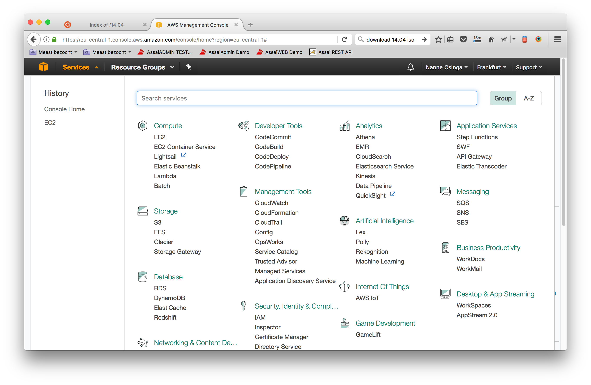

* Go to EC2 and click `Launch Instance`
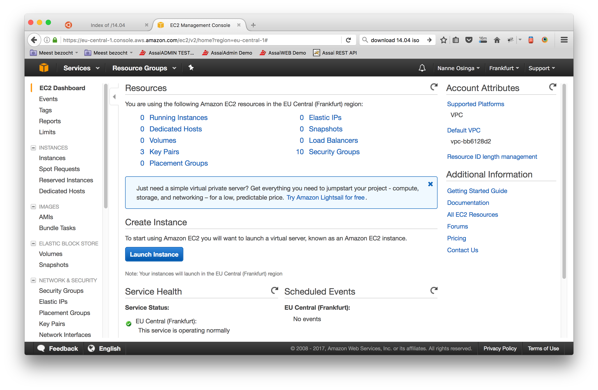

####Step 1: Choose an Amazon Machine Image (AMI)
* Now you have to choose an Amazon Machine Image (AMI), scroll down to the bottom and choose `Ubuntu Server 14.04 LTS (HVM), SSD Volume Type - ami-b89a57d7`

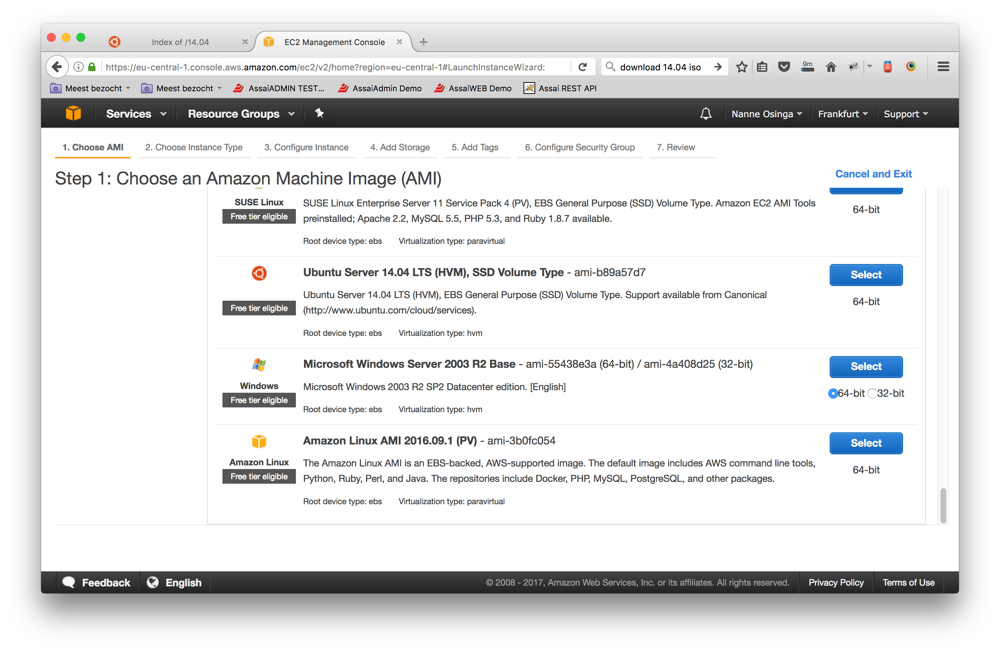

####Step 2: Choose an Instance Type
* Choose t2.medium, this gives you a Memory of 4 GB
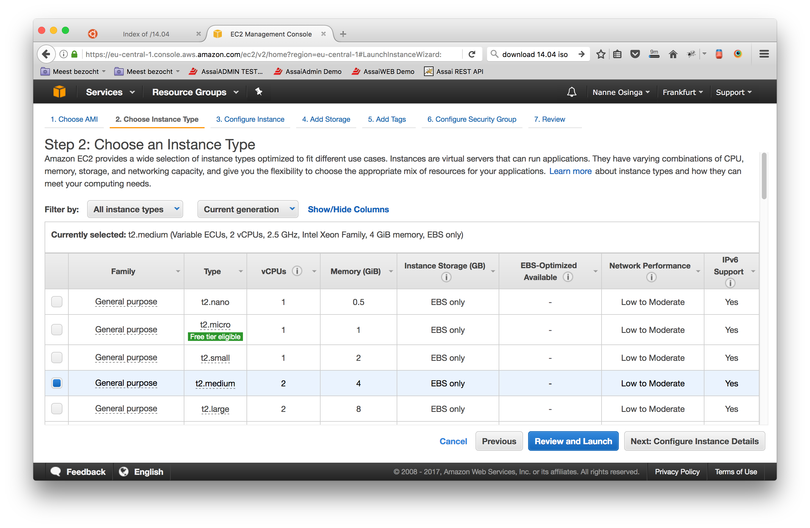

####Step 3: Configure Instance Details
* In Step 3: Configure Instance Details, you can keep the defaults here

####Step 4: Add Storage
* Chande the storage to 25 GB
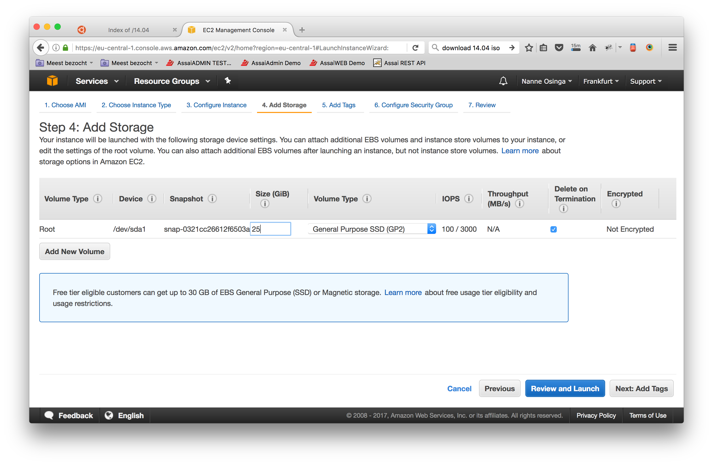

####Step 5: Add Tags
* Fill in `Name` : `vaizrdemobox`
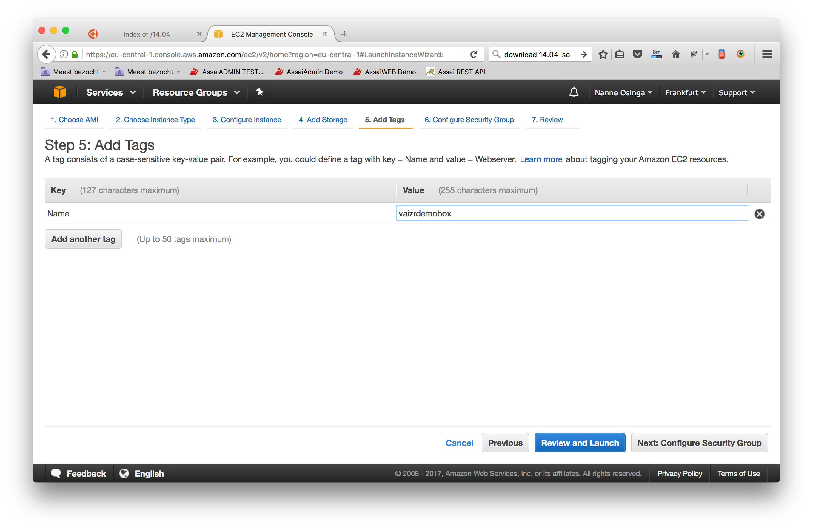

####Step 6: Configure Security Group
* here we add four ports:

                * Port Range:22  
                * Port Range:80  
                * Port Range:8080  
                * Port Range:8084  

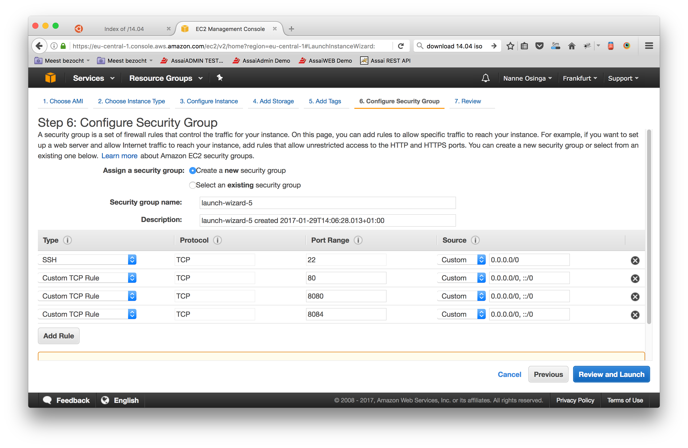

####Step 7: Review Instance Launch
* Review instance.
* And click `Launch`.
* Now you get the following screen, choose an existing key pair or create a new one.
* After acknowledging `[v] I acknowledge ...` 
* You can click `Launch Instances`
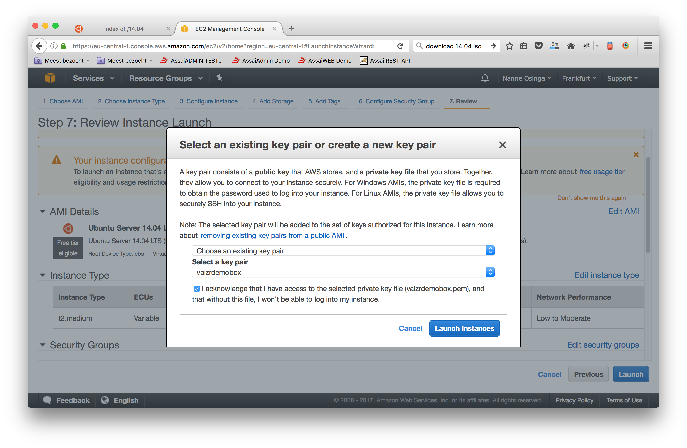

* After launching you get the **Lauch Status** screen
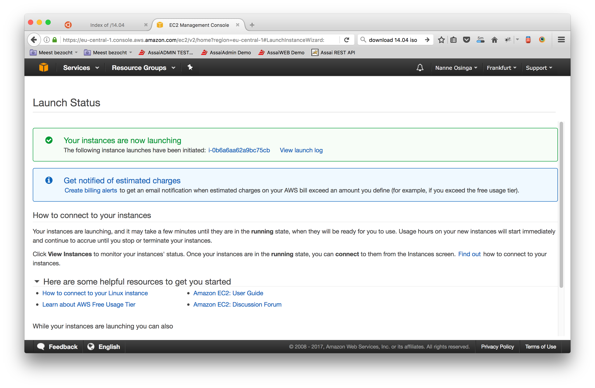

* Clicking on the Instance ID gives you the Instance Overview
* Wait till the **Status Checks** becomes green.
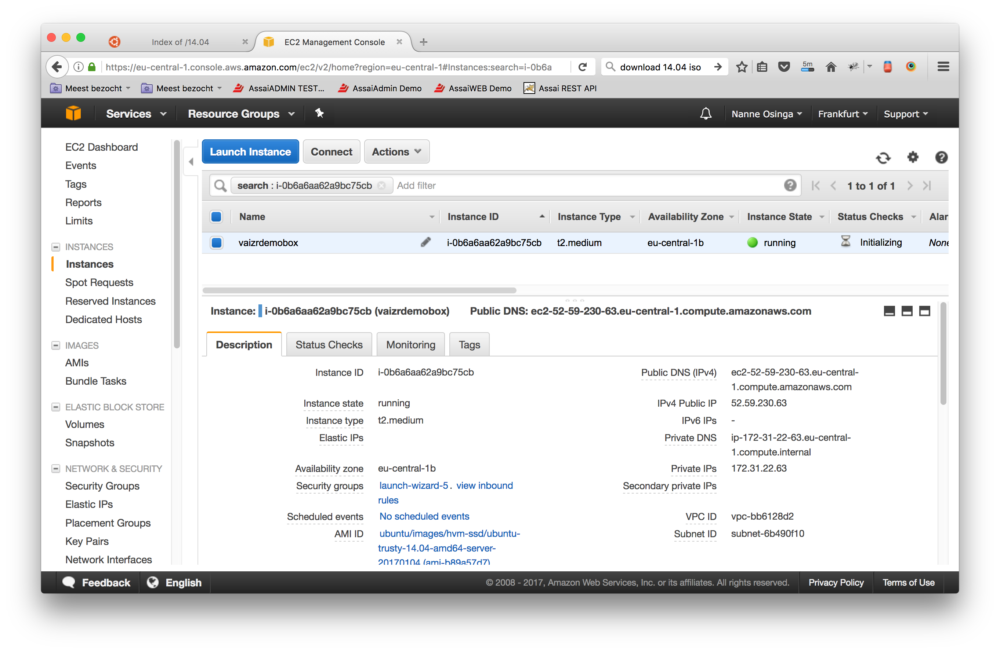

* Now you can connect to your new created Instance
* Click on the `connect` button
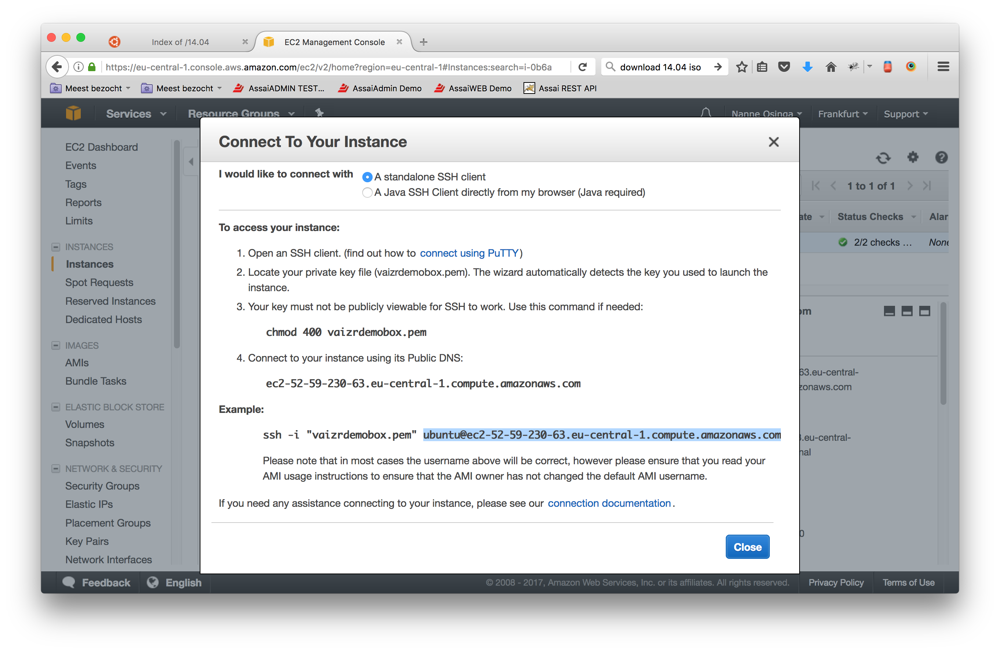

* run as `ubuntu` the `localinstall_all.sh` script on the `AWS vaizrdemobox`.  
   This script can be found in the `vaizrdemohostscripts` under `install`.  
   You can sftp the script to the vaizrdemobox or you can execute it directly with an ssh command.  
   If you have an ssh prompt you can run the following command: `ssh -i "<aws-private-key>" ubuntu@<aws-address> < localinstall_all.sh`

                   Nannes-MacBook-Pro:install nosinga$ pwd
                   /Users/nosinga/workspaces/vaizr/vaizrdemodeployment/install
                   Nannes-MacBook-Pro:install nosinga$ ssh -i ./../cli/pem/awsvaizrdemobox.pem ubuntu@ec2-54-93-90-231.eu-central-1.compute.amazonaws.com < localinstall_all.sh 
                   Pseudo-terminal will not be allocated because stdin is not a terminal.
                   Welcome to Ubuntu 14.04.5 LTS (GNU/Linux 3.13.0-106-generic x86_64)
                   
                    * Documentation:  https://help.ubuntu.com/
                   
                     System information as of Tue Jan 31 10:18:17 UTC 2017
                   
                     System load:  0.0               Processes:           104
                     Usage of /:   3.2% of 24.47GB   Users logged in:     0
                     Memory usage: 1%                IP address for eth0: 172.31.23.250
                     Swap usage:   0%
                   
                     Graph this data and manage this system at:
                       https://landscape.canonical.com/
                   
                     Get cloud support with Ubuntu Advantage Cloud Guest:
                       http://www.ubuntu.com/business/services/cloud
                   
                   0 packages can be updated.
                   0 updates are security updates.
                   
                   New release '16.04.1 LTS' available.
                   Run 'do-release-upgrade' to upgrade to it.
                   
                   
                   Ign http://eu-central-1.ec2.archive.ubuntu.com trusty InRelease
                   Get:1 http://eu-central-1.ec2.archive.ubuntu.com trusty-updates InRelease [65.9 kB]
                   Get:2 http://eu-central-1.ec2.archive.ubuntu.com trusty-backports InRelease [65.9 kB]
                   Hit http://eu-central-1.ec2.archive.ubuntu.com trusty Release.gpg
                   Hit http://eu-central-1.ec2.archive.ubuntu.com trusty Release
                   ...
                   ...
                   ...
                   tmp/ansible-tmp-1485858212.1-267261430371833/source", "state": "file", "uid":                    1000}
                   
                   PLAY RECAP ************************************************************************** 
                   127.0.0.1                  : ok=59   changed=53   unreachable=0    failed=0   
                   
                   Nannes-MacBook-Pro:install nosinga$ 

At this point we have created the start situation for [Getting Started](./index.md)

