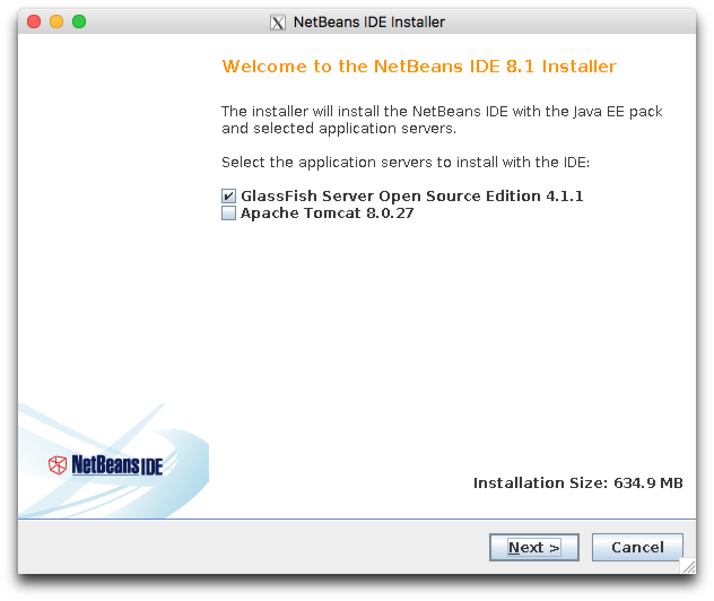
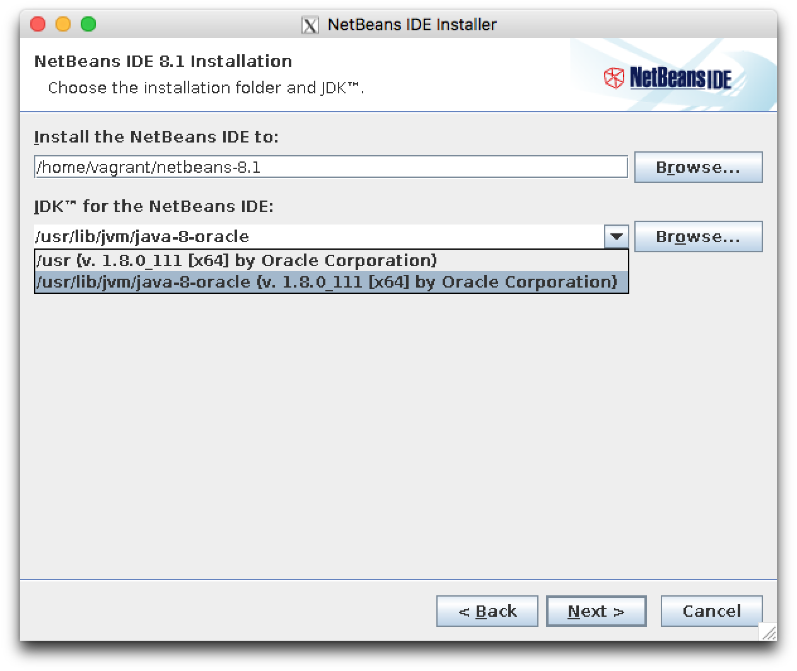
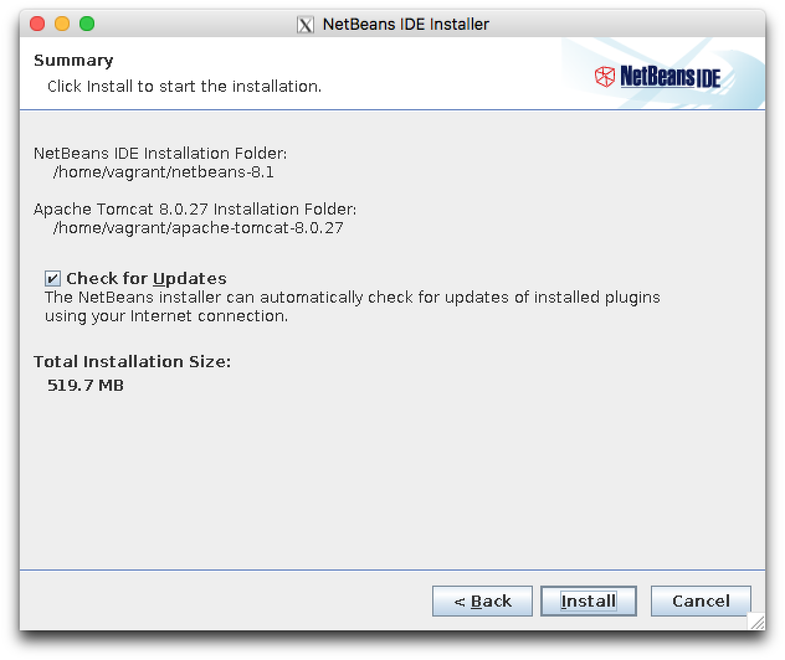
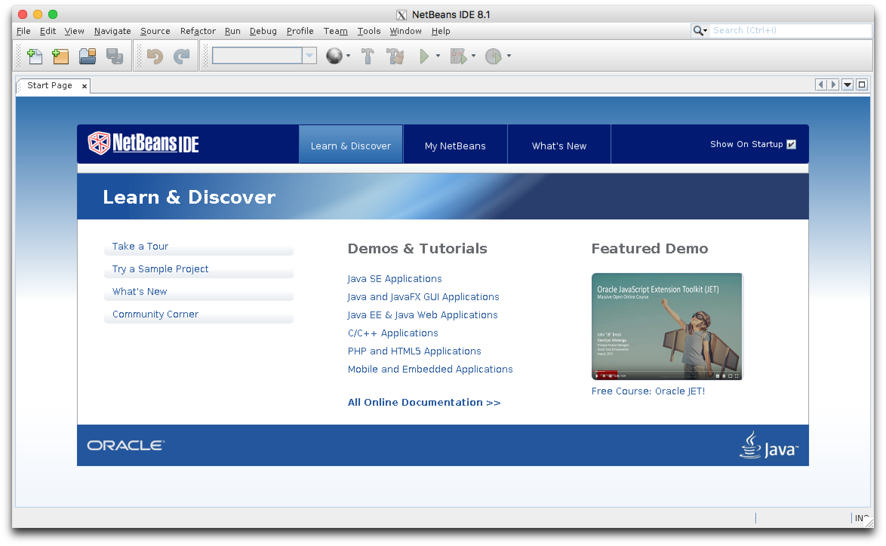
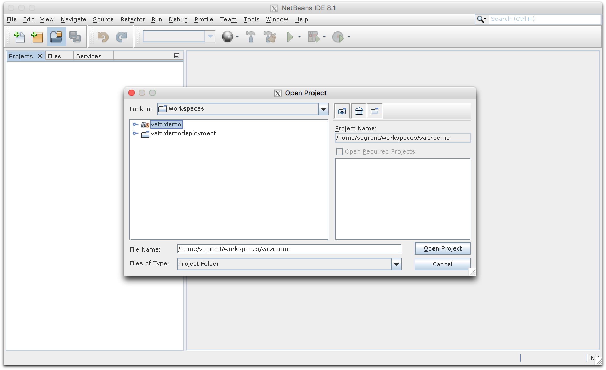
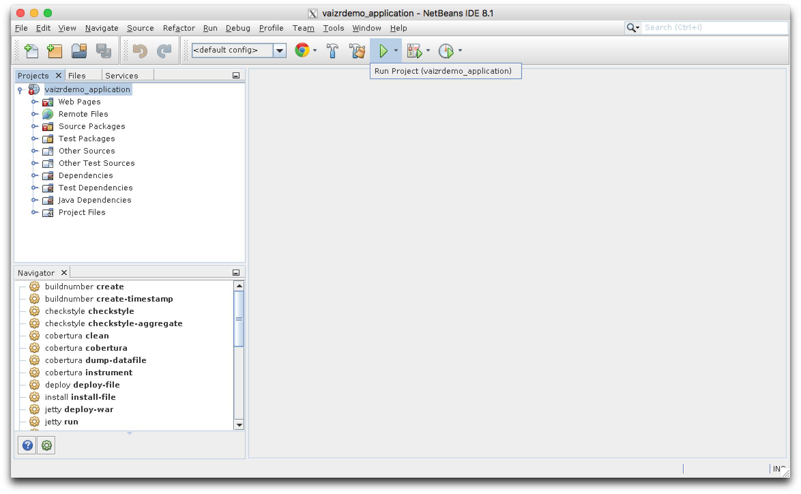
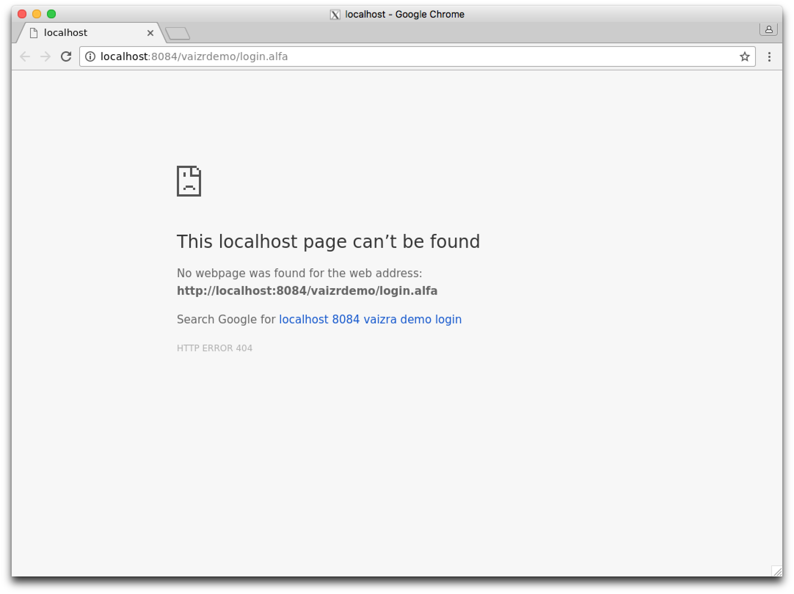
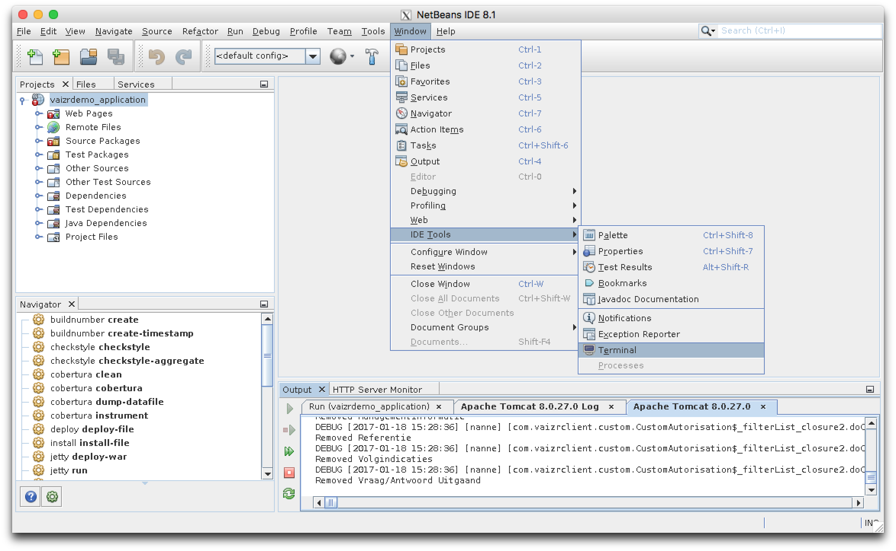
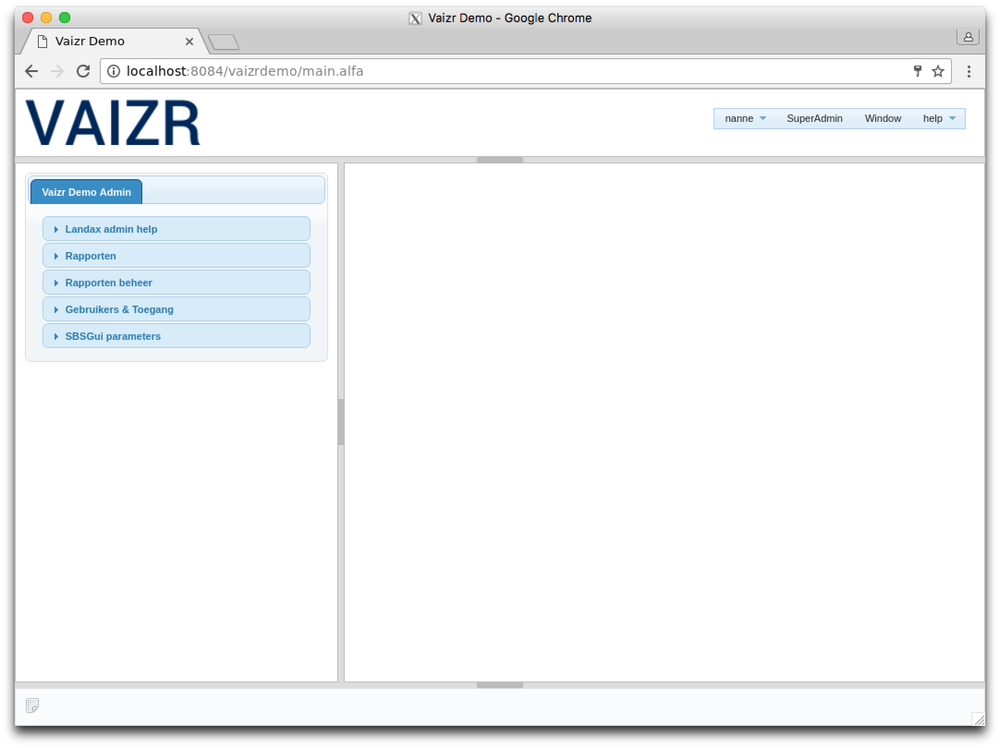

## Install NetBeans
NetBeans is already prepackaged on the vaizrdemo box. However the installation requires some manual steps. Of course you are free to use whichever IDE you prefer like Eclipse or IntelliJ. The main reasons we choose to prepackage with also NetBeans are twofold

1. Eclipse does not out of the box support maven
2. IntelliJ Community Edition comes without a integrated application server

NetBeans comes out of the box with prepacked support for tomcat. However some manual steps are required before we can start to work with NetBeans.  

* host  $`. ./install_netbeans`
* guest $`install_netbeans`

> You should see the following screen now
> 

> Deselect GlassFish and select Apache Tomcat

* [`  `] GlassFish Server Open Source Edition 4.1.1
* [`v`] Apache Tomcat 8.0.27
 
 

* Click `Next >`

> Accept the license agreement

*  [`v`] I accept the terms in license agreement
 
 

* Click `Next >`

> Set the explicit path for the JDK `/usr/lib/jvm/java-8-oracle` See screenshot below

> 

* Click `Next >`

> Keep the default for the apache tomcat installation

* Click `Next >`

* You should now see the following summary

> 

* Click `Next >`

* Finally click `Finish`

## Run NetBeans

* host  $`. ./netbeans`
* guest $`netbeans`

You should see the following screen
> 

* Deselect **Show On Startup** [` `]

* Close **Start Page**

* Now open the project **vaizrdemo** which is located in workspaces. `Open Project`

* Double-click on **workspaces**

> 

* Select **vaizrdemo**

* Double-click on **vaizrdemo**

* After opening the project you are asked to enter a master password. Just click `Cancel`
> 

* Now you get after a while the following screen. Please wait till all the indexes by NetBeans are build. You can see when NetBeans is still busy by looking at the footer of the page

> 

* Now click the **green traingle** in the ribbon. The **Play** button. When hoovering the Play button it should show the text `Run Project(vaizrdemo_application)`. See also above screenshot.

* After clicking the Play button the google-chrome browser will be started. And you will get the following screen
> 

> One more step and you are up and running. We have to set a specific configuration file in the NetBeans tomcat environment. This step can only be executed after tomcat has been initialized, which has been done by the previous step.

* Close the google-chrome browser

> Now you see the NetBeans IDE screen again  

> The configuration file we will set with prepackeged shell script. The easiest way to execute this script is by starting a terminal session from within the NetBeans IDE. The terminal can be found under __W__indow ==> IDE __T__ools ==> T__e__rminal
> 

Within the terminal you can run the following script

$`install_vaizrdemo-1.0-SNAPSHOT_xml.sh`

Please be aware that autocomplete works so after typing `install_v` you can just hit `tab` and the line will be completed to `install_vaizrdemo-1.0-SNAPSHOT_xml.sh`

Hit `Return` and after that restart the server by clicking the Play button

Now you get the following screen in google-chrome

Login with

> username : `nanne`  
> password : `nanneo`

Now you will see the menu screen of the Vaizr Professional Power UI and this is the end of this chapter.
