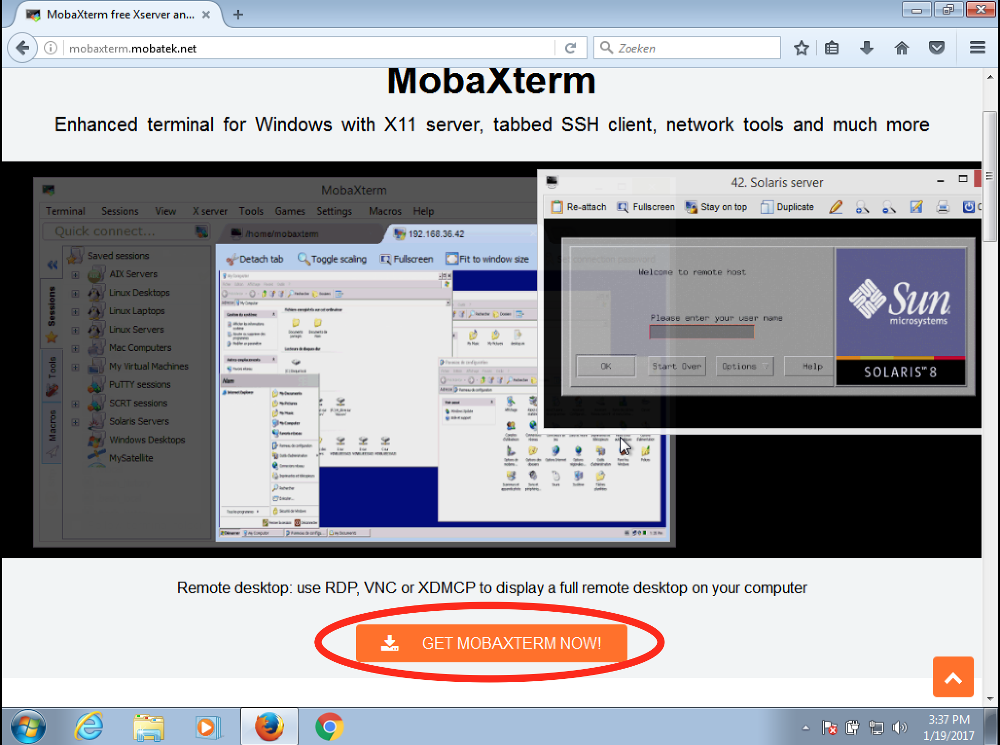
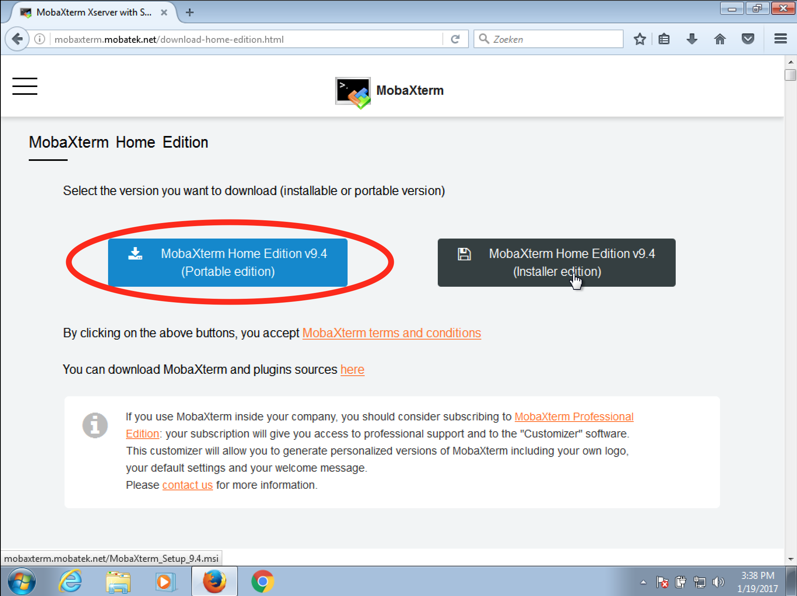
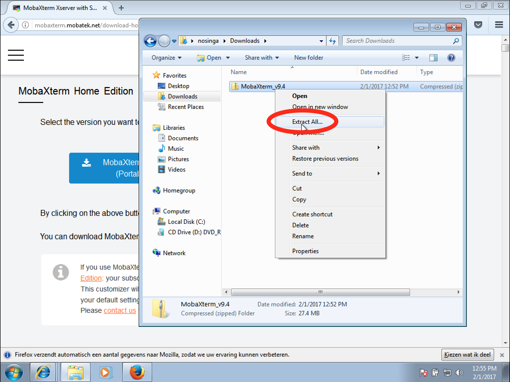
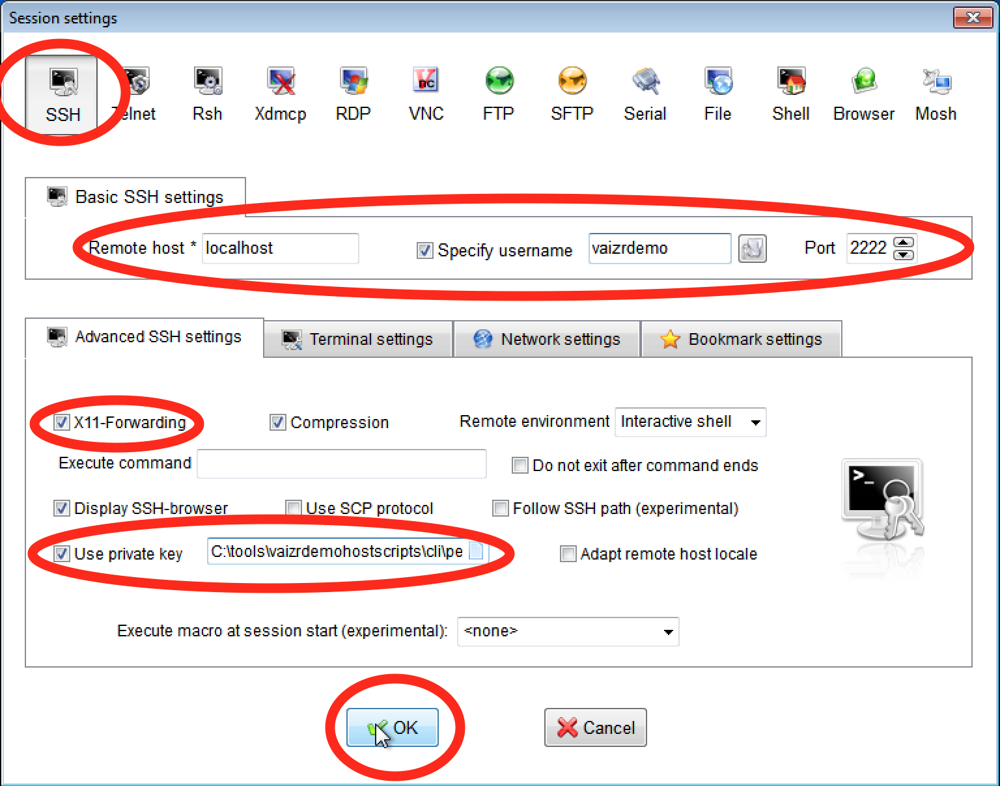
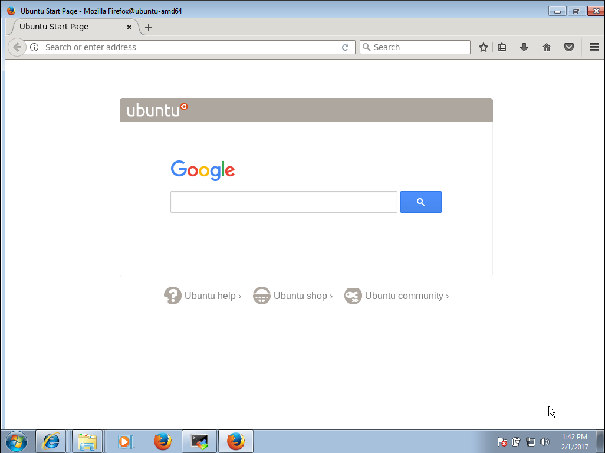

# Windows MobaXterm

On windows you need to install an **X-server** and you get proper **ssh** support with it. **Mobatek** has a nice free edition which works well.

## Download and Install MobaXterm
- go to <a href="http://mobaxterm.mobatek.net" target="_blank">http://mobaxterm.mobatek.net</a> you will see the following screen.  

      

- After clicking `GET MOBAXTERM NOW!` you see the follwing screen.  

    

- Choose the `Home Edition, Download now`  

    

- Choose the `Portable edition`  

    

- Choose the `File save` and `OK` 

    

- Choose `Extract`

    

- Extract to `C:\tools\MobaXterm_v9.4`

    

- Double Click on `MobaXterm_Personal_9.4`

    

- You see the MobaXterm start screen now.  
- You can click on `Start a new remote session` 

    

- And Open the `Advanced SSH settings` you see the session start screen.  

- You can logon with a password `vaizrdemo` or with a private key, in the latter case follow the steps below. A private key is provided in the **vaizrdemohostscripts.zip** file. 

- Here you can also choose to `Use private key`

- Unzip the **vaizrdemohostscripts.zip** file in `C:\TOOLS` and the private keys can be found in the `..\cli\pem` folder. Choose for the **l**ocal**v**irtual**m**achine the `lvmvaizrdemobox.pem` file.  
 
- In conclusion, in the MobaXterm remote sessionscreen fill in the following values:

       - Remote host `localhost`
       - `v` Specify username `vaizrdemo`
       - Port `2222`
       - `v` Use private key `C:\tools\vaizrdemohostscripts\cli\pem\lvmvaizrdemobox.pem`  

## Run SSH
- Click the OK button as you can see at the above screenshot

    

- If you see something like this it's ok  

          Welcome to Ubuntu 14.04.4 LTS (GNU/Linux 3.13.0-83-generic x86_64)

           * Documentation:  https://help.ubuntu.com/

            System information as of Tue Jan 17 08:57:54 UTC 2017

            System load:  0.37              Processes:           96
            Usage of /:   8.5% of 39.34GB   Users logged in:     0
            Memory usage: 3%                IP address for eth0: 10.0.2.15
            Swap usage:   0%

            Graph this data and manage this system at:
               https://landscape.canonical.com/

            Get cloud support with Ubuntu Advantage Cloud Guest:
              http://www.ubuntu.com/business/services/cloud

          New release '16.04.1 LTS' available.
          Run 'do-release-upgrade' to upgrade to it.

          vaizrdemo@ubuntu-amd64:~$

- Check if X-windows is working properly.

    

- Type after the `$` command prompt `firefox` and hit return
- $`firefox`

    

- Ignore the errors which flow over your terminal screen, it's ok as long as you see the firefox screen starting.

    

- The firefox start screen.  
 

- We can do the same for Google-Chrome. You activate chrome by accepting the following two options.  
    

1. $`google-chrome`
2. choose `OK`

## Run GUI tools on vaizrdemobox
One last remark about X-Windows Server and Windows and Mac. On Mac we can execute the scripts directly from the host. However to run convienant the commands we have to set the guest with the `. ./guest_set_execute_env.sh` before and execute the commands with `. ./` in front of the actual command. On Windows it is more convienant to start the SSH session from within MobaXterm. After logging on to the Ubuntu box we can simply execute the command. Since on the Vaizr Demo Ubuntu box the scripts are packaged in the ~/bin directory which has been added to the Path. In this chapter I will repeat the commands twice but after this chapter I will normally only show the host version.

>  * host ==> **Mac**, run command in **terminal**
>   * guest ==> **Windows**, run command in **MobaXerm terminal**  

* host  $`. ./firefox`
* guest $`firefox`

    

If everything is alright you should see the above screen. You can also use any browser on your Windows desktop directly  

URL `http://localhost:8080/vaizrdemo`  

You can login with:

username : `nanne`  
password : `nanneo`  

Click [Here](./../../professionalpowerui/gettingstarted) to return to [Getting Started](./../../professionalpowerui/gettingstarted)  

Click [Here](./../../professionalpowerui/masterdetail) to continue with [Generating Master Detail](./../../professionalpowerui/masterdetail)
