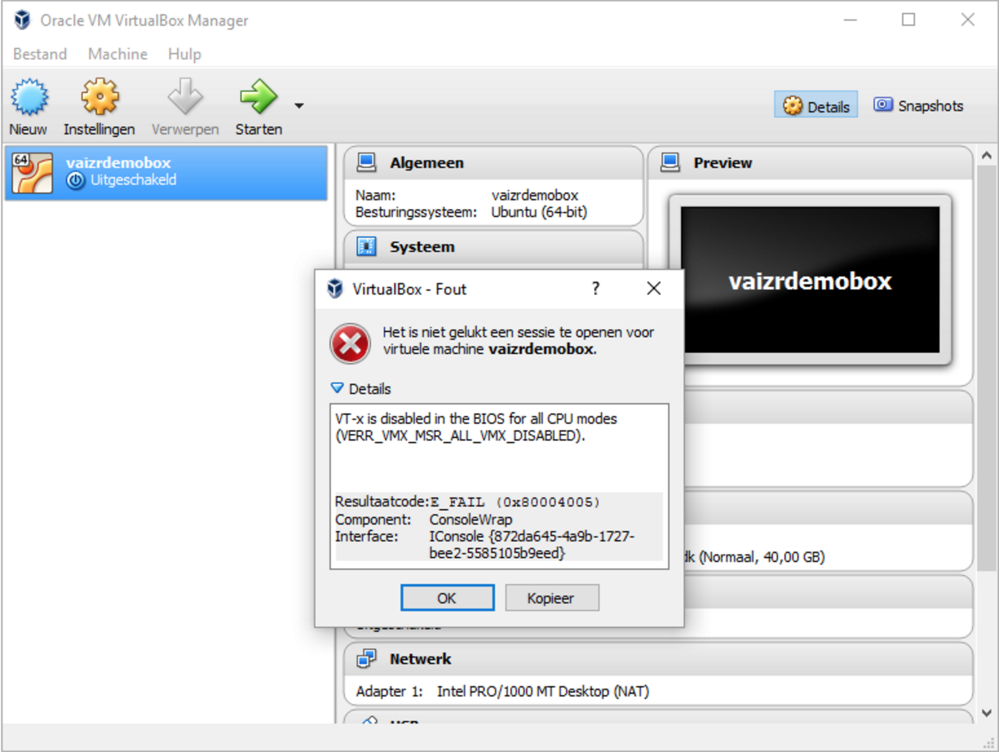

# Welcome to Vaizr Professional Power UI

## Overview
Vaizr Professional Power UI is a fast, simple and open low-code platform that's geared towards building enterprise-ready applications fast.

### Vaizrdemobox pre-build Ubuntu 14.04 
Vaizr builds completely independent war's, which run on any Sevlet Engine.  However Vaizrdemo download comes prepackaged with Tomcat, Apache, PostgreSQL and IntelliJ which is installed on Ubuntu 14.04 LTS.

The demo development environment runs completely on the ubuntu box. The GUI of IntelliJ and the different browsers like google-chrome and firefox are displayed to you via **X-Windows**. The X-Windows software on your machine is called the **host** or **server**. The X-Windows part on the remote machine, the vaizrdemobox either on VirtualBox or on AWS are called the **guest** or **client**.

This client–server terminology – the user's terminal being the server and the applications being the clients – often confuses new **X** users, because the terms appear reversed. But X takes the perspective of the application, rather than that of the end-user: X provides display and I/O services to applications, so it is a server; applications use these services, thus they are clients. More information on <a href="https://en.wikipedia.org/wiki/X_Window_System" target="_blank">X-Windows</a> you can find <a href="https://en.wikipedia.org/wiki/X_Window_System" target="_blank">here</a> 

The quickest way to get started is by downloading the Vaizr development virtual machine.

However building the Vaizr development virtual machine is also easy. Building the machine yourself will only take one more step and an additional 15 minutes and after that you know for sure that are no hidden quirks and you can do it yourself on any environment you like. Scripts are available to deploy and run on Amazon automatically. In this documentation we will show  how to do that on VirtualBox and on AWS.

## Getting started

### <a href="./../downloads/leavemail" target="_blank">Download the different components</a>
There are several ways to get started but the quickest way of getting started is to by downloading the <a href="./../downloads/leavemail" target="_blank">Vaizr development virtual machine</a>.  

Before you can run the virtual machine on your host you have to install
<a href="https://www.virtualbox.org/" target="_blank">Virtual Box</a>.  
To run the prepackaged development tools on the virtual machine you also have to install an **X-windows** server. We also provide some handy host scripts which you can download in a separate zip file.  

So in short you have to execute the following four steps:  

1. Download and Install <a href="https://www.virtualbox.org/" target="_blank">Virtual Box</a>.  
2. Download and Install <a href="./../downloads/leavemail" target="_blank">Vaizr development virtual machine</a>.  
3. Download and Unzip <a href="./../downloads/leavemail" target="_blank">Vaizr development host scripts</a>  
4. Download and Install an X-Windows server.  
    
    * For Mac use <a href='https://www.xquartz.org/' target='_blank'>XQuartz</a>.
    * Linux provided with a GUI comes with a X-Windows server out of the box.  
    * For Windows use <a href="http://mobaxterm.mobatek.net/" target="_blank"> MobaXterm</a>.  

You can directly logon to the machine or use SSH to log on. We will first start with X-Windows interface to explore the demo machine. We will also install IntelliJ to develop a Master Detail screen in the next Chapter.

### Run Vaizr Development machine
1. Start Virtual box, you actually start your virtual machine host.
2. Press Command-I(Mac), CTRL-I(Windows), in menu (File==>Import Appliance...)
3. Select the virtual image from Vaizr (vaizrdemobox.ova)
4. Click Continue
5. Click Import; after a little time your image should be imported
6. Now select your virtual machine (vaizrdemobox)
7. Click start; normal start
8. Give it a little time to start the Ubuntu distribution with the Vaizr installation running

Double-clicking on the `vaizrdemobox.ova` in your finder or file explorer gives the same result as the first four steps above.  
Click `Import`
Selecting and Double-clicking again on the `vaizrdemobox` in left pane of the **Oracle VM Virtual Box Manager** activates the remaining step six, seven and eight.

### Virtual box needs an enabled VT-x

When running on Windows, it is possible that you get the following error in Virtual Box `VT-x is disabled in the BIOS for all CPU modes`  

The trick is to `enable VT-x in the BIOS`

You may have virtualization disabled on the host computer. To enable:

    Go to your host computer's BIOS (press F12, or Delete, or F2, ... depends on computer).
    Find some options regarding virtualization. E.g. recent Lenovo's have it under Security / Virtualization.
    Enable what's there to enable. E.g. VT-d technology [Enable].

### Check Vaizr Development machine
First of all you can login on the console which is started with Virtualbox
> username : `vaizrdemo`  
> password : `vaizrdemo`

The next part is different for Windows versus Mac and Linux, of course when you run bash on windows you an also execute the scripts which are described in the Mac Linux section.

<a href="./../../appendix/windows_mobaxterm" target="_blank">Windows X-Window</a> &nbsp;&nbsp;<a href="./../../appendix/mac_xquartz" target="_blank">Mac X-Window</a>

