# Generate Some Simple Screens with Vaizr

This is a tutorial for non-technical users who are interested in learning more about Vaizr. By following these steps, you’ll learn fundamental Vaizr features while working through some simple tasks.

Depending on how you got here, you may or may not have already downloaded vaizrdemobox for your platform and installed it. Got Vaizrdemobox?  

If you haven’t yet downloaded vaizrdemobox for your platform or installed it, go to [Get vaizrdemobox](./gettingstarted).

In this tutorial we generate screens based on two tables. One table for **activities** and one for **impedements**. After the creation of the two tables we are going to generate the screens:

The following 9 steps are described in detail below  

1. Start and activate IntelliJ (one time only)  
2. Create the two tables. (scripts are prepared)  
3. Generate Meta Data  
4. Generate application files  
5. Copy generated application files (to proper directories) 
6. Build and deploy to tomcat  
7. Copy generated menu part into application menu  
8. Add permissions for new menu  
9. Check the result  

## Start and activate IntelliJ
First we start IntelliJ. Intellij is the Integrated Development Environment (IDE). Of course you are free to use whichever IDE you prefer like Eclipse or NetBeans. 

>  * host ==> **Mac**, run command in **local terminal**. For details click <a href="./../../appendix/mac_xquartz/#run-gui-tools-on-vaizrdemobox" target="_blank">Here</a>
>   * guest ==> **Windows**, run command in **MobaXerm terminal**. For details click <a href="./../../appendix/windows_mobaxterm/#run-gui-tools-on-vaizrdemobox" target="_blank">Here</a> 

* host  $`. ./intellij`
* guest $`intellij`

  
In the **intellij_complete_installation** click `OK`


In the **JetBrains Privacy Policy** click `Accept`


In the **Set The UI theme** click `Skip All and Set Defaults`


You will see the **IntelliJ StartUp Screen** for a few seconds

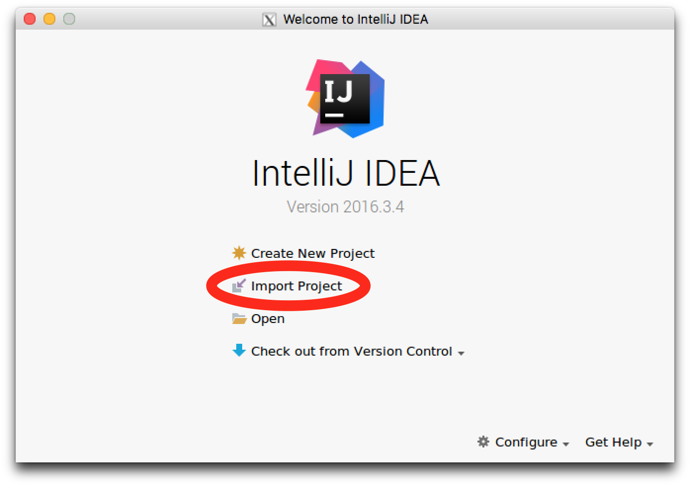
In the **IntelliJ IDEA welcome screen** click `Import Project`


In the **Select directory with Maven pom file**  Select the following file  
`/home/vaizrdemo/workspaces/vaizrdemo/pom.xml`  
Double-Click or Click `OK`

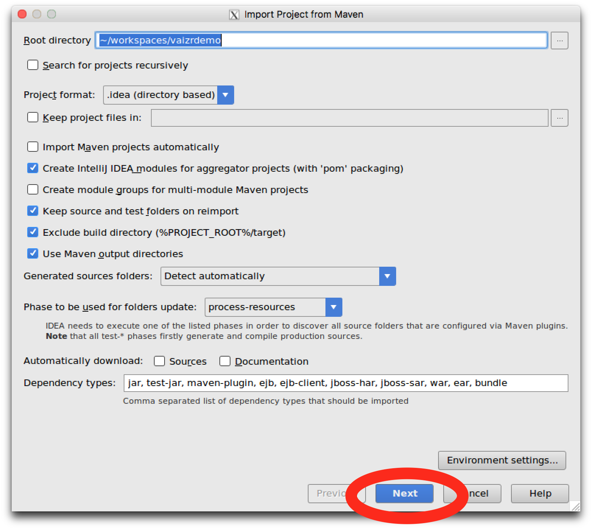
In the **Import Project from Maven**  Click `Next`  


In the **Select Profiles**  Click `Next`  


In the **Select Maven Projects to Import**  Click `Next`  

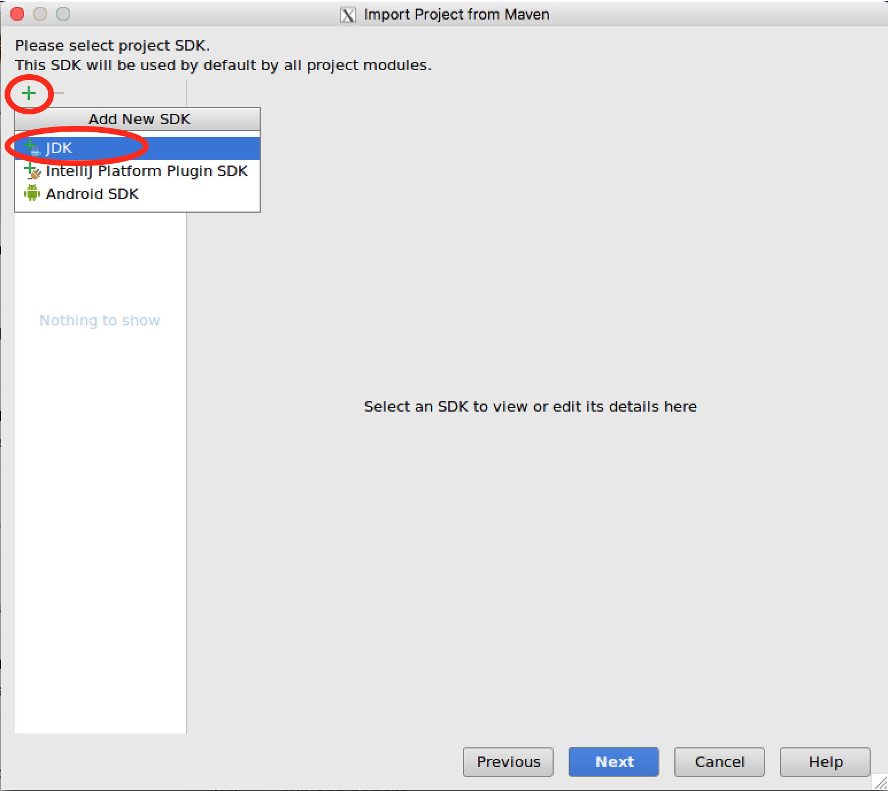
In the **Please select project JDK** you have to execute the following steps  
1. Click on **<font color="green" size="10">+</font>**  the green plus sign in the left upper corner  
2. Click on **JDK**  


3. Double-click on the **jvm** folder, this folder should open now  
4. In the open **jvm** folder select the first sub folder  
5. This is the **java-8-oracle** folder  
6. In the top field you should see the following selection `/usr/lib/jvm/java-8-0racle`  
7. At the bottom of **Select Home Directory for JDK**  Click `OK`  

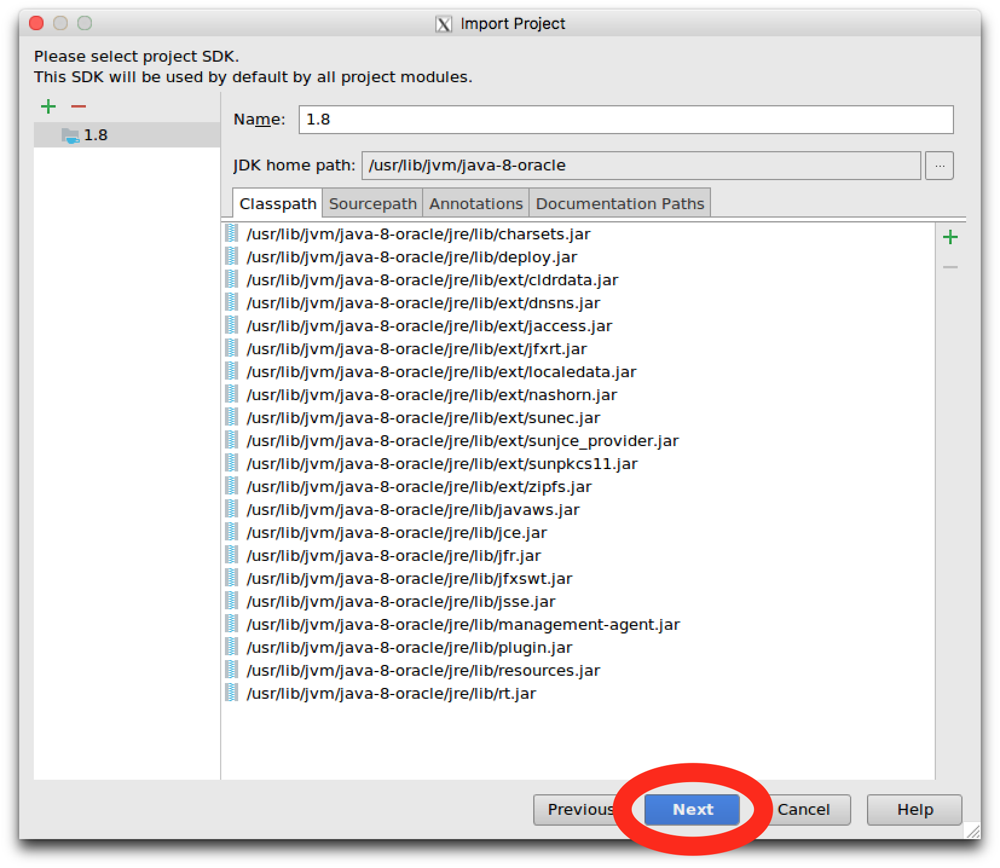
In the **Import Project**  Click `Next`  

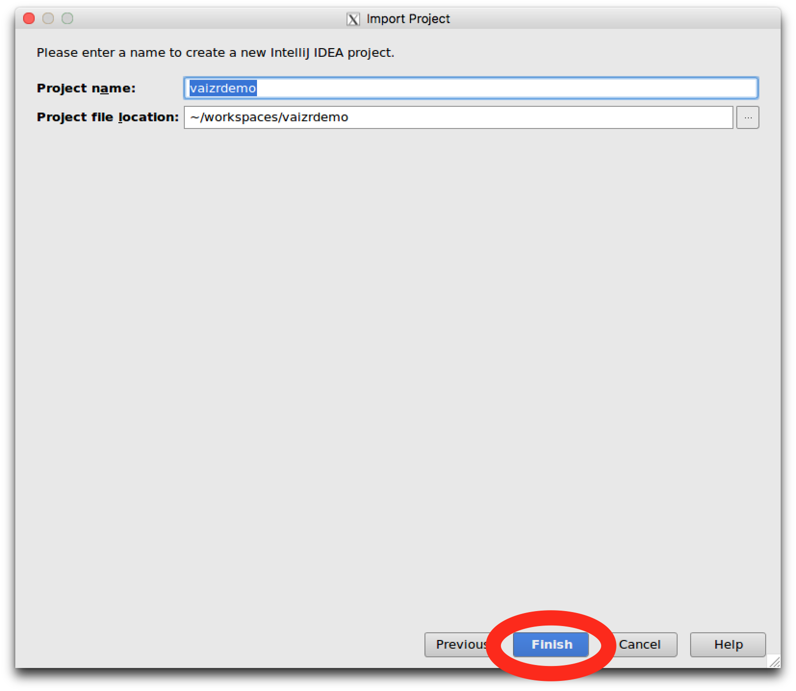
In the **Please enter a name to create a new IntelliJ IDEA project.**  Click `Finish`  


Finally De-Select **Show Tips on Startup**  
And click `Close`

##Once again these above steps you only have to do *Once*

Now **wait** till indexing is **finished** You can see that at the bottom of the screen


You know when indexing is finished when you don't see it anymore


## Create the two tables  

For this tutorial we have to connect to the database. Implicit we connected to same database in the first tutorial. The credentials for this database are given below:

      username : vaizrdemo
      password : vaizrdemo
      database : vaizrdemo
      portnumber : 5432

There are several ways to connect to the database. Now we use the command line in IntelliJ. For your convience **pgadmin3** is also installed on the vaizrdemobox.   


Put your mouse over the little dark square in the bottom left.
And leave your mouse there "**hover**". This is also indicated by an initial pop-up **Tools Windows Quick Access** which you can click away.  
After two seconds a menu will come up.  

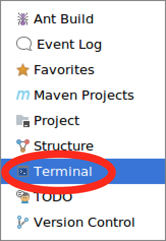  
Click here on `Terminal`

Now a terminal will open.  

Type in the following command `psql -U vaizrdemo`  

Please be aware that in this X-terminal IntelliJ the **command** is most times the **CTRL** button.  
Select the following **SQL statements**.  
Copy the **SQL statements**.  
And paste the **SQL statements** in the IntelliJ terminal with **CTRL V**  

## Create tables SQL script

```sql
DROP TABLE if exists tsl_impedements
;
DROP TABLE if exists tsl_activities
;

CREATE TABLE tsl_activities
(
    id serial
,   usr_id integer NOT NULL
,   description character varying(100) NOT NULL
,   creationtime date
)
;

ALTER TABLE tsl_activities
    OWNER to vaizrdemo
;

CREATE TABLE tsl_impedements
(
    id serial
,   act_id integer NOT NULL
,   description character varying(100) NOT NULL
)
;

ALTER TABLE tsl_impedements
    OWNER to vaizrdemo
;

ALTER TABLE tsl_activities ADD
  CONSTRAINT tsl_act_pk PRIMARY KEY (id)
;

ALTER TABLE tsl_activities
    ADD CONSTRAINT tsl_act_usr_fk FOREIGN KEY (usr_id)
    REFERENCES urp_users (id)
;

ALTER TABLE tsl_impedements ADD
  CONSTRAINT tsl_imp_pk PRIMARY KEY (id)
;

ALTER TABLE tsl_impedements
    ADD CONSTRAINT tsl_imp_act_fk FOREIGN KEY (act_id)
    REFERENCES tsl_activities (id)
;


```
After running the **SQL statements**. You should see the following screen.  


Now we start the real work in the IntelliJ IDEA
## Generate Meta Data  

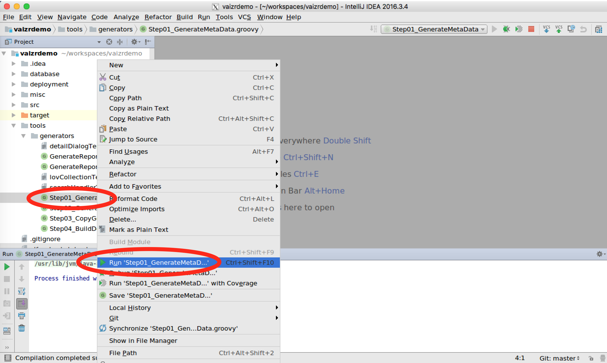
If you open in the left pane the directory **tools**. You see a sub directory **generators**  
Right mouse click on the **Step01_GenerateMetaData.groovy** script.   
Select **Run 'Step01_GenerateMetaData'** in the DropDown menu and `Click`.  


After running the **Run 'Step01_GenerateMetaData'**. You should see the following screen.  


## Generate Application Files  


Right mouse click on the **Step02_GenerateApplicationFiles.groovy** script.   
Select **Run 'Step02_GenerateApplicationFiles'** in the DropDown menu and `Click`.  

After running the **Run 'Step02_GenerateApplicationFiles'**. You should see the following screen.  


## Copy Generated Files  

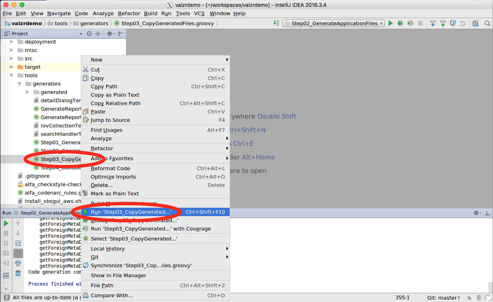
Right mouse click on the **Step03_CopyGeneratedFiles.groovy** script.   
Select **Run 'Step03_CopyGeneratedFiles'** in the DropDown menu and `Click`.  

After running the **Run 'Step03_CopyGeneratedFiles'**. You should see the following screen.  


## Build and Deploy to Tomcat  
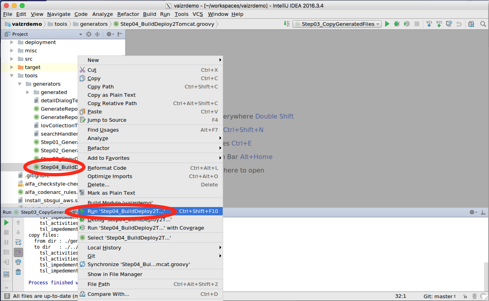
Right mouse click on the **Step04_BuildDeploy2Tomcat.groovy** script.   
Select **Run 'Step04_BuildDeploy2Tomcat'** in the DropDown menu and `Click`. 

After running the **Run 'Step04_BuildDeploy2Tomcat'**. You should see the following screen.  
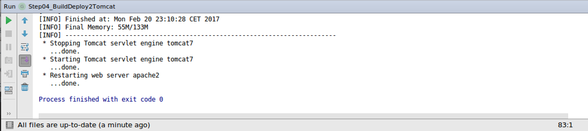

## Copy generated menu part into application menu  
Our build tasks in IntelliJ are finished and the last couple of tasks will be executed within the Vaizr Application. We have to make the new screens accessible in the menu of the Vaizr Application. This step consists of two actions.  
1. Add the new screen to the menu.  
2. Give permission on menu and screens to the proper role.  

First we will have look to the generated menu items. The generated menu can be found in `tools\generators\generated\navigation.json` If we open this file in IntelliJ we see the following structure.


The names are not yet pretty. The menu items are not encapsulated with a main menu and for permission we only see the splaceholder `<fill_in_permission>`. For your convienence a prettified menupart is added below:

## Prettified Generated Menu part

```json
  ,
  {
    "name": "Master Detail Demo",
    "permission": "masterdetaildemo",
    "id": "thesprintlab_id",
    "items": [
      {
        "name": "Activities",
        "permission": "masterdetaildemo",
        "id": "nav_experimental_tsl_activities_id",
        "fn": "Assai.mainPageHandler.showSearchRecordsTab",
        "parameters": {
          "datasource": null,
          "recordType": "tsl_activities"
        },
        "disabled": false
      },
      {
        "name": "Impedements",
        "permission": "masterdetaildemo",
        "id": "nav_experimental_tsl_impedements_id",
        "fn": "Assai.mainPageHandler.showSearchRecordsTab",
        "parameters": {
          "datasource": null,
          "recordType": "tsl_impedements"
        },
        "disabled": false
      }
    ]
   }
```

This above menu part you are going to add to the menu of the vaizrdemo application. This you will do in the web application **Vaizr** itself.

Yuo can start a firefox browser in a separate window. 

>  * host ==> **Mac**, run command in **terminal**
>   * guest ==> **Windows**, run command in **MobaXerm terminal**  

* host  $`. ./firefox`
* guest $`firefox`

You can also run you preferred browser on your own desktop. Simply point to the following url `http://localhost:8080/vaizrdemo`  

You can login with:

username : `nanne`  
password : `nanneo`   

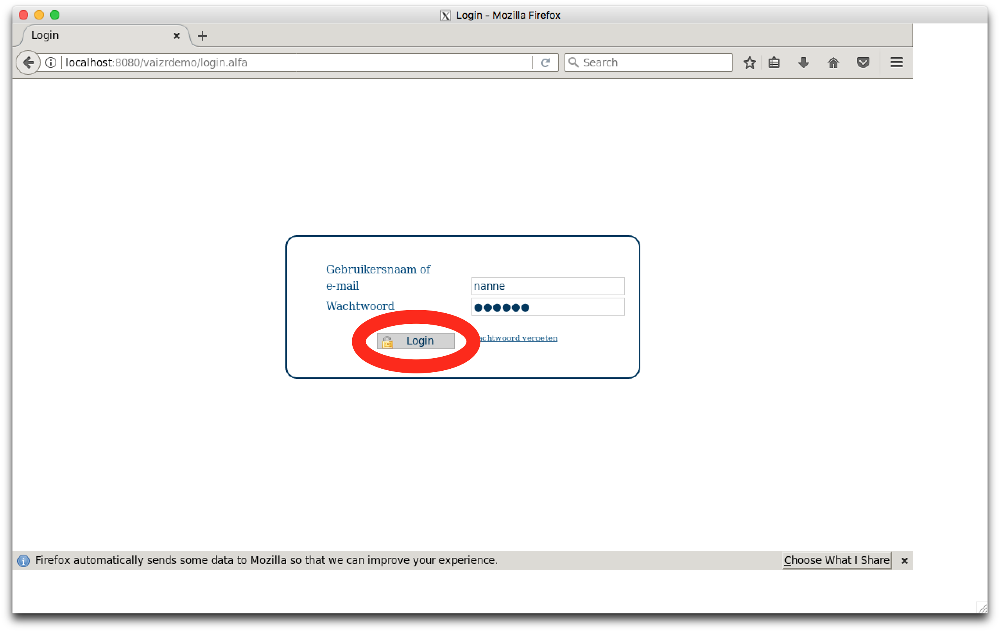

Go in the menu to **SBSGui parameters**.   
Click and go to **Multiline parameters**.   
Click again and in the right pane you see now a **Multiline parameters** search screen.  
Click `Search` . You now see 5 records. 

Double Click on **Main Menu**, the last record.


After double clicking on **Main Menu** you should see the following screen.


Scroll to the bottom and hit return **before** the **<font size="10">]</font>** the square closing bracket.  


You can see that the `Save` and `Undo` buttons are activated now.

Copy the following json part just before the square bracket.

```json
  ,
  {
    "name": "Master Detail Demo",
    "permission": "masterdetaildemo",
    "id": "thesprintlab_id",
    "items": [
      {
        "name": "Activities",
        "permission": "masterdetaildemo",
        "id": "nav_experimental_tsl_activities_id",
        "fn": "Assai.mainPageHandler.showSearchRecordsTab",
        "parameters": {
          "datasource": null,
          "recordType": "tsl_activities"
        },
        "disabled": false
      },
      {
        "name": "Impedements",
        "permission": "masterdetaildemo",
        "id": "nav_experimental_tsl_impedements_id",
        "fn": "Assai.mainPageHandler.showSearchRecordsTab",
        "parameters": {
          "datasource": null,
          "recordType": "tsl_impedements"
        },
        "disabled": false
      }
    ]
   }
```


The screen should look like above
Click on `Save` or click on `Save and Close`

On the buttons the text is not `Save and Close` but `Opslaan en sluiten`. The whole application is multilingual, Vaizr is also deployed in Russia and China and the buttons and all other texts in the application are there translated to those subsequent languages.

## Optional Step, *Not Necessary*, check the validity of your JSON
You can check and prettify the menu in an <a href="http://jsonviewer.stack.hu/" target="_blank">online JSON viewer</a>. Just do **CTRL A** and **CTRL C** and paste the **menu** in the JSON viewer. You should see the following in the JSON Viewer. Here you have possibilities to format as well.


 If your JSON is not well formed you get the following error. You have to correct the error before saving the menu.


After saving the menu you can logoff and logon and check if the menu is still functioning. Now the final part. Adding the permission for the new menu.

##Give permissions for the added menu  


Open the **permissions** which can be found in the **Users & Permissions** section.  
Click on `Add`  


In the **permissions add screen** we add the **masterdetaildemo** permission.  
Fill in `masterdetaildemo` and click `Save`.  


The `Add` button in the role permission sub part is active now.  
Click on the activated `Add` button in the role permission sub part.


Next we are adding the role **SuperAdmin**. Just type `s` in the field.  
Click on `SuperAdmin` which appears on the screen


After saving and closing the windows we **log off** and **log on** again to check our work.

##Check the result  

If you see the following screen you succeeded in generating some simple screen.

